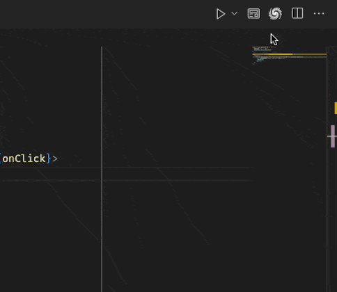

# Change Log

All notable changes to the "windcraft" extension will be documented in this file.

Check [Keep a Changelog](http://keepachangelog.com/) for recommendations on how to structure this file.

### 0.0.5

* Fixes issue on WSL where the extension was not working due to timeouts while waiting for the TypeScript Language Server Plugin to start - this has been fixed by increasing the attempts to connect to the server and wait for vs to start up.

### 0.0.4

* Enable WindCraft to add the `ClassName` property to JSX elements in TypeScript files.
* Added additional decorator for showing the empty className attribute in JSX elements.
* Fixed issue when scroll updating values in the editor, updates are now more accurate.
* Fixed issue where some classNames in scope should not be inherited by the child elements e.g. "flex" class should not be inherited by the child elements.

### 0.0.3

TypeScript Language Server Plugin version 🚀

This release adds TypeScript Language Server Plugin support to WindCraft. This brings the initial improvement of adding cascading classes details in the editor. On the longer term this will unlock more features.

Placeholder for unlicensed users to get a license key have been added. This is a temporary measure to allow users to continue using WindCraft while we work on the licensing system - we are evaluating ways for users to support the development of this tool.

Added a WindCraft button for tsx files to open the WindCraft editor. Hopefully this will make it easier for users to open the editor.

### 0.0.1

Initial release of the extension! 🚀

Sections added:
* Dynamics - for state modifiers like device modes / theme mode / hover / focus / active / disabled etc.
* Element - for element properties like position / size / rotation / border / overflow etc.
* Flex Layout - for flexbox layout properties
* Layer - Mex Blend  / Opacity / Visibility
* Constraints - for layout top / bottom / left / right / center etc. for positioning elements
* Text - for text properties like font size / font weight / font style / text color etc.
* Background - for background properties like background color
* Border - for border properties like border color / border width / border radius etc.
* Layer Effects - for shadow / blur / spread / opacity / color etc.
* Backdrop Effects - for shadow / blur / spread / opacity / color etc.

Added debug mode 🐞 adding red outline on the element