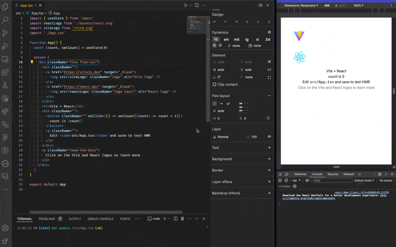
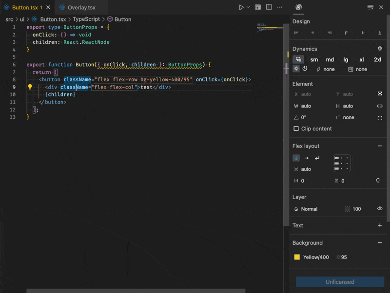
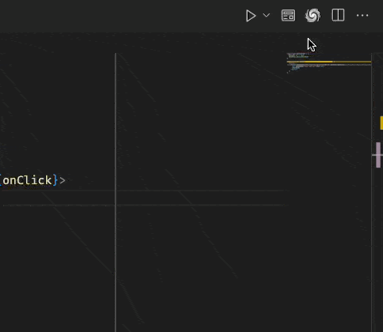

# WindCraft

WindCraft is a small tool for visually editing Tailwind CSS classes. It aims to provide a simple and intuitive way to create Tailwind CSS classes without having to remember all the class names or managing the long class names.

## Features

> Tip: Tailwind CSS classes are added to the element as you edit the properties. You can see the classes added in the class attribute of the element.

## Requirements

This extension depends on Tailwind CSS v4.x

## Extension Settings

This extension contributes the following settings:

* `windcraft.themeFile`: Tailwind CSS theme css file path. *(Defaults to project `main.css` or the Tailwind CSS `theme.css` package file)*

## Known Issues

* Currently might add more styles than needed - working on a way to reduce the number of classes added
* Performance / Accessibility / Usability improvements in planned

## Release Notes

Preview release of WindCraft - a visual Tailwind CSS editor.

### 0.0.3

TypeScript Language Server Plugin version 🚀

This release adds TypeScript Language Server Plugin support to WindCraft. This brings the initial improvement of adding cascading classes details in the editor. On the longer term this will unlock more features.

Placeholder for unlicensed users to get a license key have been added. This is a temporary measure to allow users to continue using WindCraft while we work on the licensing system - we are evaluating ways for users to support the development of this tool.

Added a WindCraft button for tsx files to open the WindCraft editor. Hopefully this will make it easier for users to open the editor.

### Next Release

* Add preview mode to see the changes in real-time
* Add tooltips on all buttons and inputs to help users understand what each button does
* Improve accessibility and usability of the editor
* Add support for design system tokens

---

## For more information

* [WindCraft Repository](https://github.com/tinytek-io/windcraft)

**Enjoy!**
